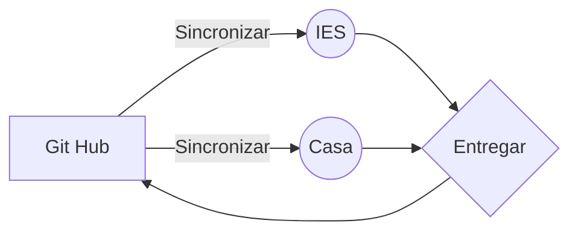

# IES Valle del jerte - Plasencia
## LMSGI
Esquema resumen entrega de practicas

Ejemplo de formulas en Markdown

$$
x = \frac {-b \pm \sqrt {b^2 - 4ac}}{2a}
$$

*[LMSGI]: Lenguaje de Marcas y Sistemas de Gestion de Informacion